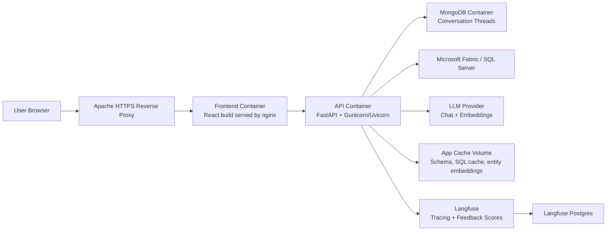

# Pulse AI Deployment Technical Document

## 1. Purpose

This document describes how to deploy and operate the Pulse AI application on an Ubuntu VM using Docker Compose, Apache reverse proxy, MongoDB, Langfuse, and the application embedding/cache layer.

The deployment target used in production is:

- Application URL: `https://pulseai.arvindfashions.com`
- Langfuse URL: `https://langfuse.arvindfashions.com`
- Application directory: `/opt/ai-da-agents`
- Langfuse directory: `/opt/langfuse`
- Runtime model: Docker containers behind Apache SSL reverse proxy

## 2. High-Level Architecture



## 3. Components

| Component | Purpose | Notes |
| --- | --- | --- |
| Apache | Public HTTPS entry point | Terminates SSL and proxies to local Docker ports |
| Frontend | User interface | React/Vite app built into static files and served by nginx |
| API | Chat orchestration backend | FastAPI app served through Gunicorn/Uvicorn |
| MongoDB | Conversation memory | Stores thread history per authenticated user |
| App cache volume | Local runtime cache | Stores schema cache, SQL semantic cache, entity embedding cache, charts |
| Langfuse | Observability | Stores traces, generations, scores, feedback |
| Langfuse Postgres | Langfuse database | Persistent volume required |
| SQL Server/Fabric | Business data source | Used for analytics queries |
| LLM/Embedding provider | Reasoning and embeddings | Used for classification, SQL generation, summarization, entity matching |

## 4. VM Prerequisites

Install the following on the Ubuntu VM:

```bash
sudo apt update
sudo apt install -y apache2 git curl ca-certificates
```

Install Docker Engine and Docker Compose plugin:

```bash
docker --version
docker compose version
```

Add the deployment user to the Docker group if needed:

```bash
sudo usermod -aG docker appuser
```

Log out and log back in after changing Docker group membership.

## 5. DNS and SSL

Create DNS records for:

```text
pulseai.arvindfashions.com
langfuse.arvindfashions.com
```

Both records must point to the Ubuntu VM public/private IP depending on the company network setup.

Company-provided wildcard SSL files are expected on the VM:

```apache
SSLCertificateFile /etc/ssl/certs/Wild_Card_arvindfashions_dot_com_2025-2026.cer
SSLCertificateKeyFile /etc/ssl/private/Wild_Card_arvindfashions_dot_com_Priavte-Key_2025-2026.key
```

Validate DNS from the VM:

```bash
nslookup pulseai.arvindfashions.com
nslookup langfuse.arvindfashions.com
```

Validate HTTPS after Apache is configured:

```bash
curl -I https://pulseai.arvindfashions.com
curl -I https://langfuse.arvindfashions.com
```

## 6. Application Directory Layout

Production application path:

```bash
/opt/ai-da-agents
```

Expected important files:

```text
api.py
src/
frontend/
Dockerfile.api
frontend/Dockerfile
frontend/nginx.conf
docker-compose.app.yml
.env.production
business_context.json
scripts/embedding_warmup.py
```

Langfuse path:

```bash
/opt/langfuse
```

Expected important files:

```text
docker-compose.yml
.env
```

## 7. Production Environment File

Create `/opt/ai-da-agents/.env.production`.

Use placeholders for secrets in documentation. Do not commit the real production file.

```env
# Azure/MSAL frontend build-time values
VITE_AZURE_TENANT_ID=<azure-tenant-id>
VITE_AZURE_CLIENT_ID=<azure-client-id>

# Backend Azure JWT validation
AZURE_TENANT_ID=<azure-tenant-id>
AZURE_CLIENT_ID=<azure-client-id>

# MongoDB
MONGO_INITDB_ROOT_USERNAME=<mongo-root-user>
MONGO_INITDB_ROOT_PASSWORD=<mongo-root-password>
MONGO_URI=mongodb://<mongo-root-user>:<mongo-root-password>@mongo:27017/?authSource=admin
MONGO_DB_NAME=ai_da_agents
MONGO_COLLECTION=conversation_threads
MONGO_USER_ID=production

# LLM and embeddings
LLM_MODEL=openai/gpt-4.1-mini
LLM_TIMEOUT_SECONDS=60
EMBEDDING_MODEL=openai/text-embedding-3-small
EMBEDDING_TIMEOUT_SECONDS=30
OPENAI_API_KEY=<openai-key>

# SQL Server / Fabric
DB_SERVER=<server>
DB_DATABASE=<database>
DB_USERNAME=<username>
DB_PASSWORD=<password>
DB_DRIVER={ODBC Driver 18 for SQL Server}

# Runtime behavior
BUSINESS_CONTEXT_PATH=business_context.json
MEMORY_MAX_TURNS=12
MEMORY_DEFAULT_THREAD=default
MEMORY_AUTO_CREATE_THREAD=true
MAX_RESULT_ROWS=200
PREVIEW_ROWS=10

# SQL and entity embedding caches
SQL_CACHE_ENABLED=true
SQL_CACHE_SEMANTIC_ENABLED=true
SQL_CACHE_SIMILARITY_THRESHOLD=0.92
SQL_DEBUG_MAX_RETRIES=1
ENTITY_SEARCH_ENABLED=true
ENTITY_STATE_CACHE_TTL_SECONDS=86400
ENTITY_STATE_SIMILARITY_THRESHOLD=0.86

# Visualization
VISUALIZATION_ENABLED=true
CHART_THEME_PATH=chart_theme.json
CHART_MAX_POINTS=50

# Langfuse
LANGFUSE_PUBLIC_KEY=<langfuse-public-key>
LANGFUSE_SECRET_KEY=<langfuse-secret-key>
LANGFUSE_HOST=https://langfuse.arvindfashions.com

# Gunicorn workers
WEB_CONCURRENCY=2
```

## 8. Application Docker Compose

The application compose file should run at least these services:

- `mongo`
- `api`
- `frontend`

The production frontend should bind only to localhost because Apache exposes it publicly:

```yaml
frontend:
  ports:
    - "127.0.0.1:8080:80"
```

The API should be available only inside Docker or localhost, depending on the Apache setup:

```yaml
api:
  expose:
    - "8000"
```

The API service must load `.env.production`:

```yaml
api:
  env_file:
    - .env.production
```

The frontend build must receive Vite Azure values as build args:

```yaml
frontend:
  build:
    context: ./frontend
    dockerfile: Dockerfile
    args:
      VITE_AZURE_TENANT_ID: ${VITE_AZURE_TENANT_ID}
      VITE_AZURE_CLIENT_ID: ${VITE_AZURE_CLIENT_ID}
```

## 9. Langfuse Hosting

Langfuse should run separately under `/opt/langfuse`.

Recommended production components:

- Langfuse web container
- Postgres database container
- Persistent Docker volume for Postgres

Important Langfuse environment values:

```env
DATABASE_URL=postgresql://<user>:<password>@langfuse-db:5432/langfuse
NEXTAUTH_URL=https://langfuse.arvindfashions.com
NEXTAUTH_SECRET=<long-random-secret>
SALT=<long-random-salt>
TELEMETRY_ENABLED=false
```

Start Langfuse:

```bash
cd /opt/langfuse
docker compose up -d
docker compose ps
```

Open Langfuse:

```text
https://langfuse.arvindfashions.com
```

Create a Langfuse project and copy:

- Public key
- Secret key
- Host URL

Add those values to `/opt/ai-da-agents/.env.production`.

## 10. Apache Reverse Proxy

Enable Apache modules:

```bash
sudo a2enmod ssl proxy proxy_http headers rewrite
sudo systemctl restart apache2
```

Application virtual host example:

```apache
<VirtualHost *:443>
    ServerName pulseai.arvindfashions.com

    SSLEngine on
    SSLCertificateFile /etc/ssl/certs/Wild_Card_arvindfashions_dot_com_2025-2026.cer
    SSLCertificateKeyFile /etc/ssl/private/Wild_Card_arvindfashions_dot_com_Priavte-Key_2025-2026.key

    ProxyPreserveHost On
    RequestHeader set X-Forwarded-Proto "https"
    RequestHeader set X-Forwarded-Port "443"

    ProxyPass / http://127.0.0.1:8080/
    ProxyPassReverse / http://127.0.0.1:8080/

    ErrorLog ${APACHE_LOG_DIR}/pulseai-error.log
    CustomLog ${APACHE_LOG_DIR}/pulseai-access.log combined
</VirtualHost>
```

Langfuse virtual host example:

```apache
<VirtualHost *:443>
    ServerName langfuse.arvindfashions.com

    SSLEngine on
    SSLCertificateFile /etc/ssl/certs/Wild_Card_arvindfashions_dot_com_2025-2026.cer
    SSLCertificateKeyFile /etc/ssl/private/Wild_Card_arvindfashions_dot_com_Priavte-Key_2025-2026.key

    ProxyPreserveHost On
    RequestHeader set X-Forwarded-Proto "https"
    RequestHeader set X-Forwarded-Port "443"

    ProxyPass / http://127.0.0.1:3001/
    ProxyPassReverse / http://127.0.0.1:3001/

    ErrorLog ${APACHE_LOG_DIR}/langfuse-error.log
    CustomLog ${APACHE_LOG_DIR}/langfuse-access.log combined
</VirtualHost>
```

Enable sites and reload:

```bash
sudo apachectl configtest
sudo systemctl reload apache2
```

## 11. Deployment Steps

Pull latest code:

```bash
cd /opt/ai-da-agents
git pull
```

Build and start:

```bash
docker compose --env-file .env.production -f docker-compose.app.yml build
docker compose --env-file .env.production -f docker-compose.app.yml up -d
```

Check containers:

```bash
docker compose --env-file .env.production -f docker-compose.app.yml ps
```

Expected services:

```text
mongo      Up
api        Up
frontend   Up
```

## 12. Health Checks

Frontend health through local container port:

```bash
curl http://127.0.0.1:8080/health
```

Public application:

```bash
curl -I https://pulseai.arvindfashions.com
```

API logs:

```bash
docker compose --env-file .env.production -f docker-compose.app.yml logs --tail=200 api
```

Frontend logs:

```bash
docker compose --env-file .env.production -f docker-compose.app.yml logs --tail=100 frontend
```

Mongo logs:

```bash
docker compose --env-file .env.production -f docker-compose.app.yml logs --tail=100 mongo
```

## 13. MongoDB Conversation Memory Checks

Verify API can connect to Mongo:

```bash
docker compose --env-file .env.production -f docker-compose.app.yml exec -T api python - <<'PY'
from pymongo import MongoClient
import os

client = MongoClient(os.environ["MONGO_URI"], serverSelectionTimeoutMS=5000)
print("ping:", client.admin.command("ping"))

db = client[os.environ.get("MONGO_DB_NAME", "ai_da_agents")]
col = db[os.environ.get("MONGO_COLLECTION", "conversation_threads")]
print("thread_count:", col.count_documents({}))
PY
```

Inspect recent threads:

```bash
docker compose --env-file .env.production -f docker-compose.app.yml exec mongo mongosh \
  -u "$MONGO_INITDB_ROOT_USERNAME" \
  -p "$MONGO_INITDB_ROOT_PASSWORD" \
  --authenticationDatabase admin \
  --eval 'const db2=db.getSiblingDB("ai_da_agents"); db2.conversation_threads.find({}, {user_id:1,thread_id:1,updated_at:1,"turns.user":1,"turns.trace_id":1}).sort({updated_at:-1}).limit(10).forEach(printjson);'
```

## 14. Embedding and Cache Setup

The app uses embeddings for:

- SQL semantic cache
- Entity/value matching
- Query reuse

Cache files are stored in the `app_cache` Docker volume:

```text
/app/.cache/schema_cache.json
/app/.cache/sql_query_cache.sqlite3
/app/.cache/state_entity_index.sqlite3
/app/.cache/charts
```

Run embedding smoke test:

```bash
docker compose --env-file .env.production -f docker-compose.app.yml exec -T api python scripts/embedding_warmup.py \
  --columns state,city,category \
  --query "sales in karnataka for shirts"
```

Expected result:

- Embedding provider returns vectors successfully.
- Entity cache opens or builds.
- Query resolves known values such as states/cities/categories.

If this fails:

- Check `OPENAI_API_KEY`.
- Check `EMBEDDING_MODEL`.
- Check API container internet access.
- Check SQL DB credentials if entity values are read from database.

## 15. Langfuse Tracing and Feedback Checks

Ask a fresh question in Pulse AI.

Confirm trace id is generated:

```bash
docker compose --env-file .env.production -f docker-compose.app.yml logs --tail=200 api | grep -E "Chat stream event includes trace_id|Feedback|Langfuse feedback"
```

Expected logs:

```text
Chat stream event includes trace_id=<uuid> type=metadata thread_id=<thread> user=<email>
Submitting Langfuse feedback score trace_id=<uuid> score=1 user=<email> comment_present=false
Langfuse feedback score submitted score_id=<uuid> trace_id=<uuid>
```

If feedback is not visible in Langfuse:

- Check browser Network tab for `POST /feedback`.
- Confirm response is `200`.
- Confirm API logs show score submission.
- Confirm the Langfuse project keys match the project being viewed.
- Check Langfuse filters and date range.

## 16. Common Operations

Rebuild only API and frontend after code change:

```bash
cd /opt/ai-da-agents
git pull
docker compose --env-file .env.production -f docker-compose.app.yml build api frontend
docker compose --env-file .env.production -f docker-compose.app.yml up -d api frontend
```

Restart API:

```bash
docker compose --env-file .env.production -f docker-compose.app.yml restart api
```

Restart frontend:

```bash
docker compose --env-file .env.production -f docker-compose.app.yml restart frontend
```

Follow API logs:

```bash
docker compose --env-file .env.production -f docker-compose.app.yml logs -f api
```

Check environment inside API:

```bash
docker compose --env-file .env.production -f docker-compose.app.yml exec api env | grep -E "MONGO|LANGFUSE|AZURE|OPENAI|DB_"
```

## 17. Backup and Restore

Back up MongoDB:

```bash
docker compose --env-file .env.production -f docker-compose.app.yml exec -T mongo mongodump \
  -u "$MONGO_INITDB_ROOT_USERNAME" \
  -p "$MONGO_INITDB_ROOT_PASSWORD" \
  --authenticationDatabase admin \
  --archive > mongo-backup-$(date +%F).archive
```

Restore MongoDB:

```bash
cat mongo-backup-YYYY-MM-DD.archive | docker compose --env-file .env.production -f docker-compose.app.yml exec -T mongo mongorestore \
  -u "$MONGO_INITDB_ROOT_USERNAME" \
  -p "$MONGO_INITDB_ROOT_PASSWORD" \
  --authenticationDatabase admin \
  --archive
```

Back up Langfuse Postgres:

```bash
cd /opt/langfuse
docker compose exec -T langfuse-db pg_dump -U langfuse langfuse > langfuse-backup-$(date +%F).sql
```

## 18. Rollback

Find previous commit:

```bash
cd /opt/ai-da-agents
git log --oneline -5
```

Rollback to a known commit:

```bash
git checkout <commit-sha>
docker compose --env-file .env.production -f docker-compose.app.yml build api frontend
docker compose --env-file .env.production -f docker-compose.app.yml up -d api frontend
```

Return to main branch later:

```bash
git checkout main
git pull
docker compose --env-file .env.production -f docker-compose.app.yml build api frontend
docker compose --env-file .env.production -f docker-compose.app.yml up -d api frontend
```

## 19. Troubleshooting

### DNS fails with NXDOMAIN

Cause:

- DNS record does not exist or has not propagated to the VM resolver.

Check:

```bash
nslookup pulseai.arvindfashions.com
nslookup langfuse.arvindfashions.com
```

### Browser works but VM nslookup fails

Cause:

- Corporate DNS split-horizon or local resolver mismatch.

Action:

- Confirm DNS with network team.
- Test from a client machine and from the VM.

### Frontend shows old behavior after deployment

Cause:

- Browser cache or old frontend image.

Action:

```bash
docker compose --env-file .env.production -f docker-compose.app.yml build frontend
docker compose --env-file .env.production -f docker-compose.app.yml up -d frontend
```

Then use hard refresh:

```text
Ctrl + Shift + R
```

### Conversation thread is not maintained

Check:

```bash
docker compose --env-file .env.production -f docker-compose.app.yml exec api env | grep -E "MONGO|MEMORY"
```

Verify Mongo documents:

```bash
docker compose --env-file .env.production -f docker-compose.app.yml exec -T api python - <<'PY'
from pymongo import MongoClient
import os
client = MongoClient(os.environ["MONGO_URI"], serverSelectionTimeoutMS=5000)
db = client[os.environ.get("MONGO_DB_NAME", "ai_da_agents")]
col = db[os.environ.get("MONGO_COLLECTION", "conversation_threads")]
print(col.count_documents({}))
PY
```

### Langfuse traces are empty

Check:

```bash
docker compose --env-file .env.production -f docker-compose.app.yml exec api env | grep LANGFUSE
```

Verify:

- `LANGFUSE_HOST` points to `https://langfuse.arvindfashions.com`.
- Public/secret keys are from the same Langfuse project.
- Langfuse container is reachable from API container.

### Feedback is not captured

Check browser Network tab:

```text
POST /feedback
```

Check logs:

```bash
docker compose --env-file .env.production -f docker-compose.app.yml logs --tail=200 api | grep -E "Feedback|Langfuse feedback|trace_id"
```

Expected:

```text
Submitting Langfuse feedback score...
Langfuse feedback score submitted...
```

### Embedding warmup fails with `No module named src`

Use the updated script path from repo root inside the API container:

```bash
docker compose --env-file .env.production -f docker-compose.app.yml exec -T api python scripts/embedding_warmup.py \
  --columns state,city,category \
  --query "sales in karnataka for shirts"
```

If it still fails, confirm the latest code is deployed and the Docker image was rebuilt.

## 20. Security Notes

- Do not commit `.env.production`.
- Do not expose MongoDB publicly.
- Bind frontend/API container ports to `127.0.0.1` when Apache is the public entry point.
- Rotate Langfuse `NEXTAUTH_SECRET`, `SALT`, public key, and secret key if leaked.
- Store SSL private key under `/etc/ssl/private` with restricted permissions.
- Keep Docker, Apache, and base images patched.
- Restrict SSH access to trusted users and networks.

## 21. Deployment Checklist

Before deployment:

- DNS records exist for both subdomains.
- SSL certificate and private key are present.
- `.env.production` is updated.
- Langfuse is running and project keys are configured.
- Docker Compose files are present.

Deploy:

- Pull latest code.
- Build API and frontend.
- Start containers.
- Reload Apache if vhost changed.

Validate:

- `curl http://127.0.0.1:8080/health`
- `curl -I https://pulseai.arvindfashions.com`
- Login works.
- Ask a business question.
- Threads persist.
- Langfuse trace appears.
- Feedback score appears.
- Embedding warmup succeeds.

