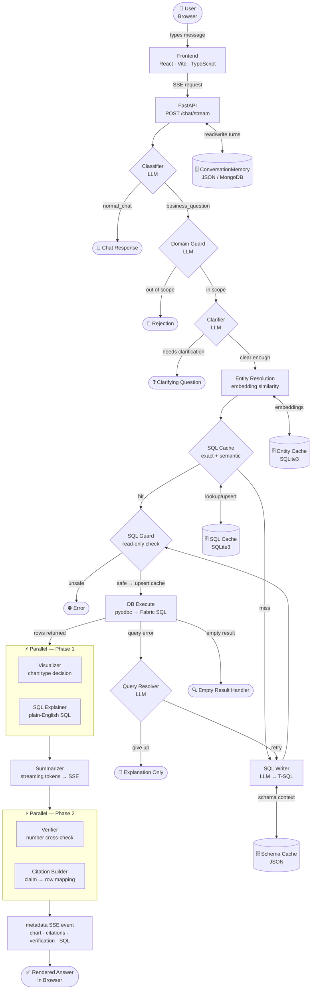
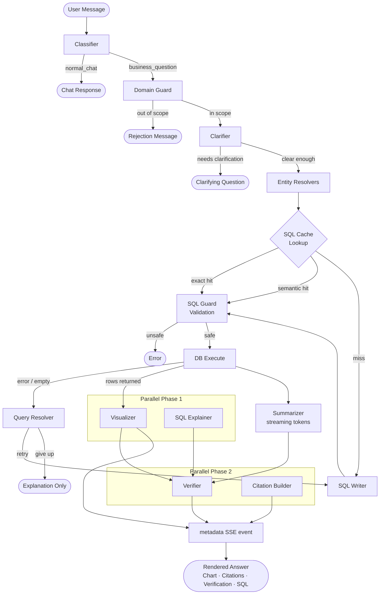
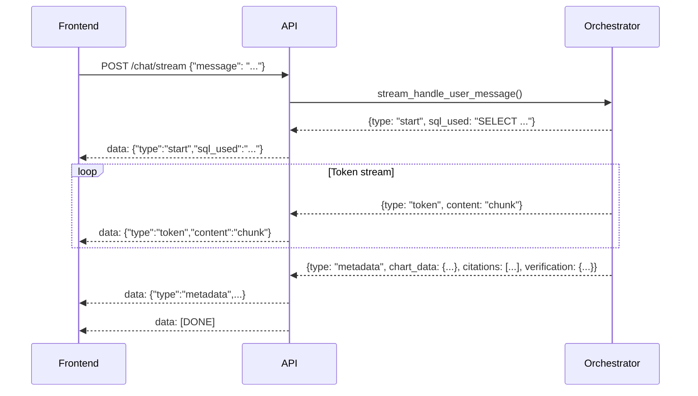
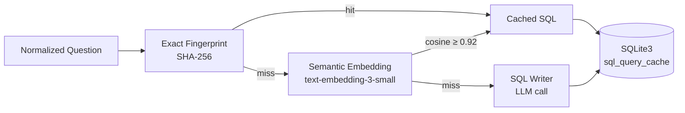
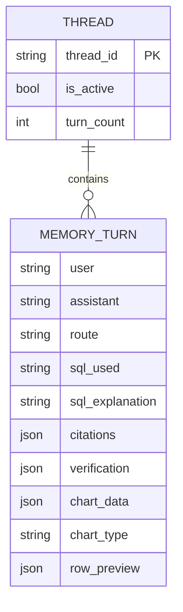
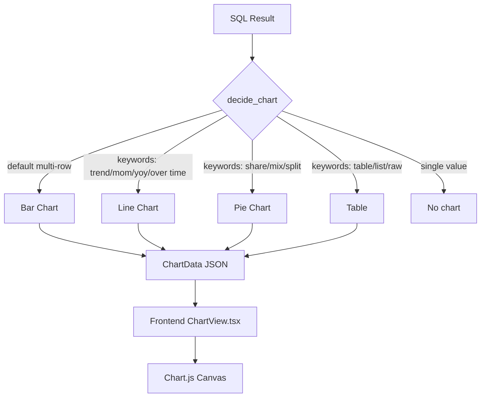
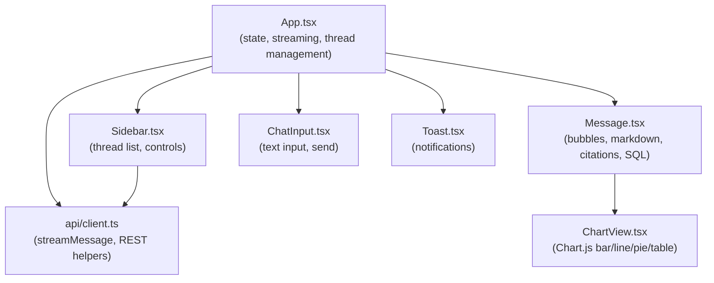

# AI-DA-Agents

**AI-powered multi-agent text-to-SQL analytics chatbot for Arvind Fashions.**

Ask natural-language business questions and get streamed answers, charts, verified citations, and drillable SQL — all grounded in live sales data from Microsoft Fabric SQL.

---

## Table of Contents

- [Overview](#overview)
- [Architecture](#architecture)
- [Agent Pipeline](#agent-pipeline)
- [Streaming Protocol (SSE)](#streaming-protocol-sse)
- [SQL Caching](#sql-caching)
- [Memory & Threads](#memory--threads)
- [Visualization](#visualization)
- [Entity Resolution](#entity-resolution)
- [API Reference](#api-reference)
- [Frontend Components](#frontend-components)
- [Configuration](#configuration)
- [Tech Stack](#tech-stack)
- [Getting Started](#getting-started)

---

## Overview

AI-DA-Agents translates natural-language retail analytics questions into T-SQL queries, executes them against the `prd.FACT_SALES_AI` table, and streams rich answers back to the user — complete with:

- **Real-time text streaming** (token-by-token via SSE)
- **Client-side Chart.js charts** (bar, line, pie, table — no HTML file generation)
- **SQL caching** (exact-match fingerprint + semantic embedding similarity)
- **Entity resolution** (fuzzy-match brand/state/city/store/category names to DB values)
- **Verification** (cross-check every number in the answer against SQL result rows)
- **Citations** (map each claim in the answer to the specific result row it came from)
- **Multi-turn memory** with named conversation threads

---

## Architecture



### Component Responsibilities

| Layer | Technology | Role |
|---|---|---|
| **Frontend** | React 19, TypeScript, Chart.js, Vite | UI, SSE consumer, client-side chart rendering |
| **API** | FastAPI, uvicorn | REST + SSE endpoints, CORS, request routing |
| **Orchestrator** | Python | Pipeline coordination, thread management, SQL caching |
| **LLM Router** | LiteLLM | Multi-provider LLM calls (OpenAI, Claude, etc.) |
| **Database** | pyodbc → Fabric SQL | T-SQL execution on Arvind Fashions sales data |
| **Caches** | SQLite3, JSON | SQL queries, entity embeddings, DB schema |

---

## Agent Pipeline

A business question passes through up to 13 agents in sequence.



### Agent Details

| # | Agent | Input | Output | LLM Call |
|---|---|---|---|---|
| 1 | **Classifier** | Message + history | `business_question` / `normal_chat` | JSON agent |
| 2 | **Domain Guard** | Message + scope definition | `in_scope`, rejection message | JSON agent |
| 3 | **Clarifier** | Message + context | `needs_clarification`, question | JSON agent |
| 4 | **Entity Resolvers** | Message text | `EntityMatch` (column, value, score) | Embeddings |
| 5 | **SQL Cache** | Normalized question + fingerprints | Cached SQL or miss | — |
| 6 | **SQL Writer** | Question + schema + context | T-SQL SELECT | JSON agent |
| 7 | **SQL Guard** | SQL string | Pass / raise `SqlGuardError` | — |
| 8 | **DB Execute** | SQL | `SqlExecutionResult` (columns, rows) | — |
| 9 | **Visualizer** | Question + result | `ChartData` (bar/line/pie/table) | — |
| 10 | **SQL Explainer** | SQL | Plain-English explanation | Text agent |
| 11 | **Summarizer** | Question + SQL + result | Streaming text tokens | Stream agent |
| 12 | **Citation Builder** | Answer + result | `list[Citation]` | JSON agent |
| 13 | **Verifier** | Answer + result | `VerificationResult` + issues | — |

---

## Streaming Protocol (SSE)

**Endpoint:** `POST /chat/stream`  
**Content-Type:** `text/event-stream`



| Event Type | Key Fields | When |
|---|---|---|
| `start` | `sql_used` | SQL resolved, streaming about to begin |
| `token` | `content` | Each text chunk from the LLM |
| `complete` | `content`, `sql_used?` | Non-streaming paths (clarification, normal chat, empty result) |
| `metadata` | `sql_used`, `sql_explanation`, `chart_data`, `chart_type`, `row_preview`, `citations`, `verification`, `answer?` | After all tokens, carries full grounding data |
| `error` | `content` | Pipeline exception |

---

## SQL Caching

Two-tier caching prevents repeated LLM calls for equivalent questions.



**Normalization rules applied before caching:**
- Remove stopwords (`a`, `an`, `the`, `show`, `give`, `tell`, …)
- Apply brand alias mappings (e.g. `USP` → `USPA`)
- Expand business term abbreviations
- Sort tokens (order-insensitive for short analytic phrases)

**Cache entry fields:** `original_question`, `normalized_question`, `sql_text`, `question_embedding`, `schema_fingerprint`, `business_fingerprint`, `hit_count`, `created_at`, `last_success_at`

---

## Memory & Threads

Each conversation lives in a named **thread**. Threads are persistent across server restarts.



**`MemoryTurn` fields:**

| Field | Type | Description |
|---|---|---|
| `user` | `str` | User's original message |
| `assistant` | `str` | Bot's full answer text |
| `route` | `Literal` | `"business_question"` or `"normal_chat"` |
| `sql_used` | `str \| None` | T-SQL executed |
| `sql_explanation` | `str \| None` | Plain-English SQL description |
| `citations` | `list[dict]` | Claim → row mappings |
| `verification` | `dict \| None` | `{verified: bool, issues: [...]}` |
| `chart_data` | `dict \| None` | Serialised `ChartData` |
| `chart_type` | `str \| None` | `bar \| line \| pie \| table` |
| `row_preview` | `list[dict] \| None` | First N result rows |

**Storage backends:**
- **Local JSON** (default): `.cache/memory_threads.json`
- **MongoDB** (optional): set `MONGO_URI` in `.env`

---

## Visualization

Charts are rendered client-side in the browser using **Chart.js** — no HTML files are generated or stored on disk.



**Column metric priority** (for MoM/growth queries):

| Priority | Column name pattern | Example |
|---|---|---|
| 0 — highest | `percent`, `pct`, `growth`, `rate`, `mom`, `yoy` | `PercentChange` |
| 1 | `change`, `delta`, `diff` | `AbsoluteChange` |
| 2 — default | any other numeric | `CurrentMonthNetSales` |
| 3 — lowest | `prev`, `previous`, `last`, `prior` | `PrevMonthNetSales` |

**Arvind Fashions colour palette:**
`#dc2626` · `#2563eb` · `#10b981` · `#f59e0b` · `#8b5cf6` · `#06b6d4` · `#f97316` · `#14b8a6`

---

## Entity Resolution

Five resolvers map free-text user input to exact database values using semantic embeddings.

```mermaid
flowchart LR
    U[User Text] --> E[Generate Embedding]
    E --> C{Cosine Similarity\nvs cached values}
    C -- score ≥ 0.86 --> M[EntityMatch]
    C -- below threshold --> F[Fuzzy String Match\nSequenceMatcher ≥ 0.88]
    F --> M
    M --> SQL[SQL WHERE clause]

    subgraph Cached in SQLite3
        S[States]
        CI[Cities]
        ST[Store Names]
        CA[Categories]
        SC[Subclasses]
    end
    C --> Cached in SQLite3
```

| Resolver | DB Column | Example match |
|---|---|---|
| `StateEntityResolver` | `STATE` | "karnataka" → `KARNATAKA` |
| `CityEntityResolver` | `CITY` | "bengaluru" → `BENGALURU` |
| `StoreNameEntityResolver` | `STORE_NAME` | "MG road" → exact store name |
| `CategoryEntityResolver` | `CATEGORY` | "shirt" → `SHIRTS` |
| `SubclassEntityResolver` | `SUBCLASS` | "polo tee" → `POLO T-SHIRTS` |

---

## API Reference

Base URL: `http://localhost:8000`

| Method | Endpoint | Request Body | Response | Description |
|---|---|---|---|---|
| `POST` | `/chat` | `{message}` | `ChatResponse` | Non-streaming chat |
| `POST` | `/chat/stream` | `{message}` | SSE stream | **Preferred** — streaming chat |
| `GET` | `/health` | — | `{status: "ok"}` | Health check |
| `GET` | `/threads` | — | `{threads, active}` | List all threads |
| `POST` | `/threads` | `{thread_id}` | `{active}` | Create a new thread |
| `PUT` | `/threads/{id}/switch` | — | `{active}` | Switch active thread |
| `GET` | `/threads/{id}/messages` | — | `{messages}` | Load thread history (with charts) |
| `GET` | `/memory` | — | `{memory}` | Formatted memory dump |
| `DELETE` | `/memory` | — | `{ok}` | Clear all threads |
| `GET` | `/cache/sql` | `?limit=10` | `{entries}` | List SQL cache entries |
| `DELETE` | `/cache/sql` | — | `{cleared}` | Clear SQL cache |
| `POST` | `/schema/refresh` | — | `{ok, length}` | Refresh DB schema cache |
| `GET` | `/context` | — | `{context}` | Show business context |

---

## Frontend Components



| Component | Key responsibility |
|---|---|
| `App.tsx` | SSE consumer; builds `MessageItem[]` from stream events; thread switching with full history reload |
| `Sidebar.tsx` | Thread list with one-click auto-named creation; schema/memory/cache controls |
| `Message.tsx` | Renders markdown answer; streaming cursor; SQL explain accordion; verification badges; citations |
| `ChartView.tsx` | Routes to `CanvasChart` (Chart.js) or `TableView`; INR number formatting; Arvind palette |
| `ChatInput.tsx` | Keyboard submit; voice input (Web Speech API, `en-IN` locale) |

---

## Configuration

Copy `.env.example` to `.env` and fill in the required values.

### Required

| Variable | Description |
|---|---|
| `OPENAI_API_KEY` | OpenAI API key (LLM + embeddings) |
| `DB_SERVER` | Fabric SQL endpoint hostname |
| `DB_DATABASE` | Database name (e.g. `Dataverse_Prod`) |
| `DB_USERNAME` | Database username |
| `DB_PASSWORD` | Database password |

### Key Optionals

| Variable | Default | Description |
|---|---|---|
| `LLM_MODEL` | `openai/gpt-4.1-mini` | LiteLLM model ID |
| `EMBEDDING_MODEL` | `openai/text-embedding-3-small` | Embedding model |
| `MEMORY_MAX_TURNS` | `12` | Max turns per thread |
| `SQL_CACHE_SIMILARITY_THRESHOLD` | `0.92` | Semantic cache hit threshold (0–1) |
| `SQL_CACHE_SEMANTIC_ENABLED` | `true` | Enable semantic SQL caching |
| `ENTITY_SEARCH_ENABLED` | `true` | Enable entity resolution |
| `ENTITY_STATE_SIMILARITY_THRESHOLD` | `0.86` | Entity match threshold |
| `MAX_RESULT_ROWS` | `200` | Max DB rows per query |
| `CHART_MAX_POINTS` | `50` | Max chart data points |
| `MONGO_URI` | _(empty)_ | MongoDB URI — enables Mongo memory backend |
| `VISUALIZATION_ENABLED` | `true` | Enable chart generation |
| `SQL_DEBUG_MAX_RETRIES` | `1` | Query resolver retry attempts |

---

## Tech Stack

### Backend

| Package | Version | Purpose |
|---|---|---|
| FastAPI | latest | REST + SSE API framework |
| uvicorn | latest | ASGI server |
| LiteLLM | ≥ 1.74.0 | Multi-provider LLM routing |
| openai | ≥ 1.0.0 | OpenAI client (LLM + embeddings) |
| pyodbc | ≥ 5.1.0 | SQL Server ODBC driver |
| pydantic | ≥ 2.7.0 | Data validation & models |
| python-dotenv | ≥ 1.0.1 | Environment variable loading |
| pytest | ≥ 8.2.0 | Testing framework |

### Frontend

| Package | Version | Purpose |
|---|---|---|
| React | 19.2.4 | UI framework |
| TypeScript | 6.0.2 | Type safety |
| Vite | 8.0.4 | Build tool & dev server |
| Chart.js | 4.5.1 | Client-side chart rendering |
| axios | 1.15.0 | HTTP client |
| react-markdown | 10.1.0 | Markdown rendering |
| uuid | 13.0.0 | Message ID generation |

---

## Getting Started

### Prerequisites

- Python 3.11+
- Node.js 18+
- ODBC Driver 18 for SQL Server
- Access to Arvind Fashions Fabric SQL endpoint

### Backend

```bash
# Install dependencies
pip install -r requirements.txt

# Configure environment
cp .env.example .env
# Edit .env with your DB credentials and API keys

# Start API server
uvicorn api:app --host 0.0.0.0 --port 8000 --reload
```

### Frontend

```bash
cd frontend

# Install dependencies
npm install

# Start dev server (proxies API calls to :8000)
npm run dev
```

Open `http://localhost:5173` in your browser.

### Cache Locations

| Cache | Path | Purpose |
|---|---|---|
| Memory threads | `.cache/memory_threads.json` | Conversation history |
| SQL cache | `.cache/sql_query_cache.sqlite3` | Cached SQL queries |
| Schema cache | `.cache/schema_cache.json` | DB schema snapshot |
| Entity cache | `.cache/state_entity_index.sqlite3` | Entity embeddings |

---

## Project Structure

```
AI-DA-AGENTS/
├── api.py                          # FastAPI app & route handlers
├── requirements.txt
├── business_context.json           # KPIs, brand aliases, column descriptions
├── chart_theme.json                # Arvind Fashions colour palette
├── .env                            # Environment variables (not committed)
├── .claude/
│   └── launch.json                 # Dev server launch configs
├── .cache/                         # Runtime caches (auto-created)
├── src/
│   ├── orchestrator.py             # Pipeline coordinator
│   ├── memory.py                   # ConversationMemory, MemoryTurn
│   ├── models.py                   # Pydantic models (BotReply, SqlExecutionResult, …)
│   ├── config.py                   # Settings (loaded from .env)
│   ├── llm.py                      # LiteLLM wrappers (run_json_agent, stream_text_agent, …)
│   ├── sql_cache.py                # SqlQueryCache (exact + semantic)
│   ├── sql_guard.py                # Read-only SQL validation
│   ├── visualization.py            # ChartData, decide_chart, build_visual_output
│   ├── entity_search.py            # 5 entity resolvers (State, City, Store, …)
│   ├── business_context.py         # BusinessContext loader
│   ├── mongo_memory.py             # MongoDB memory backend
│   └── agents/
│       ├── classifier.py
│       ├── domain_guard.py
│       ├── clarifier.py
│       ├── sql_writer.py
│       ├── query_resolver.py
│       ├── summarizer.py
│       ├── citation_builder.py
│       ├── verifier.py
│       ├── sql_explainer.py
│       ├── chat.py
│       └── empty_result_handler.py
└── frontend/
    ├── vite.config.ts
    ├── package.json
    └── src/
        ├── App.tsx
        ├── styles/chatbot.css
        ├── api/
        │   ├── client.ts           # streamMessage(), REST helpers
        │   └── types.ts            # ChatResponse, ChartData, Citation, …
        └── components/
            ├── Sidebar.tsx
            ├── Message.tsx
            ├── ChartView.tsx
            ├── ChatInput.tsx
            └── Toast.tsx
```
